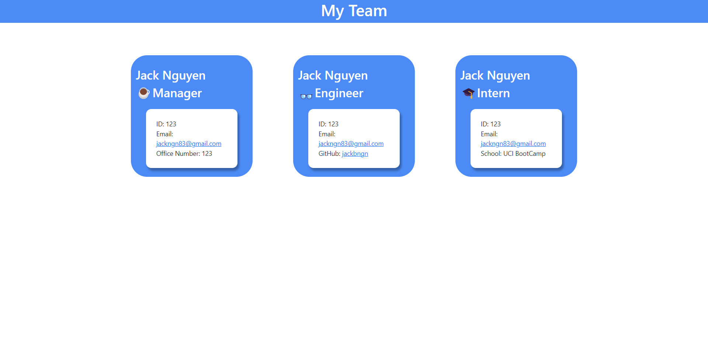

# Team Profile Generator

## Description

The task at hand is to develop a Node.js command-line application that receives employee information for a software engineering team and generates an HTML webpage with individual summaries for each employee. To accomplish this, the Inquirer package must be utilized, and version 8.2.4 is required, which can be installed with the command "npm i inquirer@8.2.4" in the project folder. Additionally, writing a unit test for each section of the code and ensuring that each test passes is essential to producing code that is maintainable and robust. By fulfilling these requirements, you will be able to create a functional and reliable application that will efficiently handle employee data and present it in an organized and accessible format.

## ScreenShot



## Acceptance Criteria

```
When the user runs the application, they are prompted to enter the team manager’s name, employee ID, email address, and office number.

After entering the team manager's information, the user is presented with a menu with the option to add an engineer, add an intern, or to finish building the team.

If the user chooses to add an engineer, they are prompted to enter the engineer’s name, ID, email, and GitHub username. After entering the information, the user is taken back to the main menu.

If the user chooses to add an intern, they are prompted to enter the intern’s name, ID, email, and school. After entering the information, the user is taken back to the main menu.

Once the user has finished building their team, they exit the application and an HTML file is generated that displays a nicely formatted team roster based on user input.

When the user clicks on an email address in the generated HTML, their default email program opens and populates the TO field of the email with the address.

When the user clicks on a GitHub username in the generated HTML, the corresponding GitHub profile opens in a new tab.
```

## Installation

1. git clone git@github.com:jackbngn/Profile-Generator.git
2. npm i inquirer@8.2.4
3. node index.js

## Usage

1. Follow the on-screen prompts to enter the team manager's name, employee ID, email address, and office number.
2. Choose from the main menu to add an engineer or an intern, or to finish building the team.
3. Enter the necessary information for each team.
